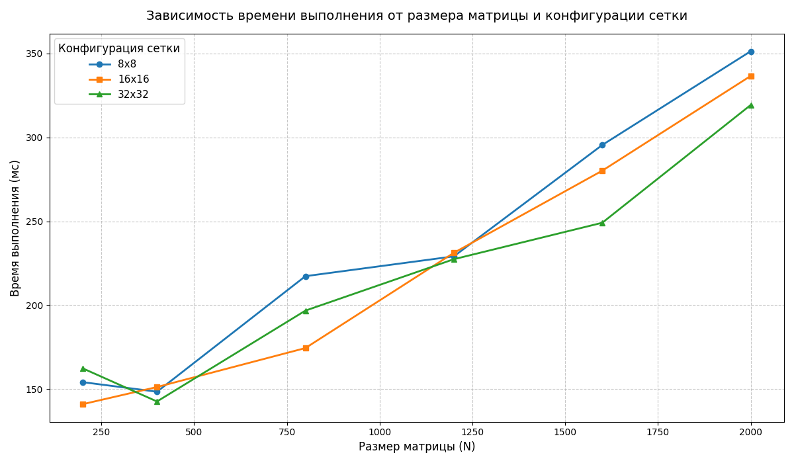

Характеристики моего ПК: 
| Поцессор | Intel Core i7-4770K 3.50GHz |
| :---: | :---: |
| Оперативная память | 16ГБ |
| Операционная система | Windows 11, 64 битная |
| Видеокарта | NVIDIA GeForce GTX 1650 |

Результаты измерений:
| Размер матрицы/Конфигурация сетки | 8x8 | 16x16 | 32x32 |
| :---: | :---: | :---: | :---: |
| 200x200 | 152.2 мс | 141.1 мс |  162.4 мс |
| 400x400 | 148.5 мс | 151.3 мс |  142.7 мс |
| 800x800 | 217.3 мс |  174.5 мс |  196.8 мс |
| 1200x1200 | 229.1 мс |  231.2 мс |  227.4 мс |
| 1600x1600 | 295.4 мс |  280.1 мс |  249.1 мс |
| 2000x2000 | 351.2 мс |  336.5 мс |  319.2 мс |

