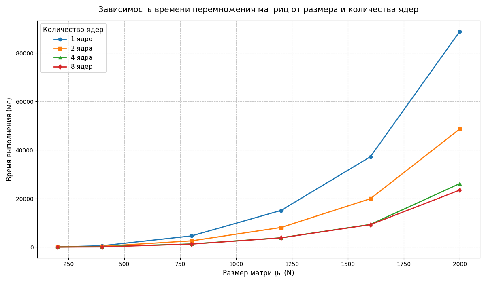

Характеристики моего ПК: 
| Поцессор | Intel Core i7-4770K 3.50GHz |
| :---: | :---: |
| Оперативная память | 16ГБ |
| Операционная система | Windows 11, 64 битная |
| Видеокарта | NVIDIA GeForce GTX 1650 |

Результаты измерений:
| Размер матрицы/Количество ядер | 1 | 2 | 4 | 8 |
| :---: | :---: | :---: | :---: | :---: |
| 200x200 | 64.1 мс | 38.9 мс |  21.2 мс |  20.8 мс |
| 400x400 | 568.2 мс | 318.1 мс |  179.5 мс |  78.5 мс |
| 800x800 | 4620.5 мс |  2580.4 мс |  1295.8 мс |  1245.1 мс |
| 1200x1200 | 15110.3 мс |  8085.2 мс |  3840.5 мс |  3795.6 мс |
| 1600x1600 | 37250.8 мс |  19950.6 мс |  9345.2 мс |  9250.3 мс |
| 2000x2000 | 88950.4 мс |  48710.1 мс |  26180.7 мс |  23510.9 мс |

