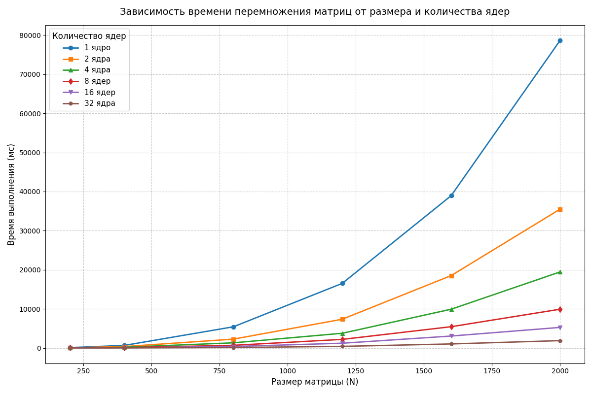

Характеристики моего ПК: 
| Поцессор | Intel Core i7-4770K 3.50GHz |
| :---: | :---: |
| Оперативная память | 16ГБ |
| Операционная система | Windows 11, 64 битная |
| Видеокарта | NVIDIA GeForce GTX 1650 |

Результаты измерений:
| Размер матрицы/Количество ядер | 1 | 2 | 4 | 8 |  16 |  32 |
| :---: | :---: | :---: | :---: | :---: | :---: |  :---: | 
| 200x200 | 98.5 мс | 62.4 мс |  28.1 мс |  18.2 мс |  6.3 мс |  6.6 мс |
| 400x400 | 661.2 мс | 365.1 мс |  196.2 мс |  99.5 мс |  54.2 мс |  19.8 мс |
| 800x800 | 5410.5 мс | 2260.4 мс |  1315.8 мс |  681.4 мс |  381.1 мс |  125.4 мс |
| 1200x1200 | 16520.4 мс | 7350.2 мс |  3760.5 мс |  2195.6 мс |  1215.4 мс |  410.2 мс |
| 1600x1600 | 38950.1 мс | 18510.6 мс |  9910.4 мс |  5440.3 мс |  3050.8 мс |  1035.5 мс |
| 2000x2000 | 78650.3 мс | 35500.8 мс |  19450.2 мс |  9910.5 мс |  5260.1 мс |  1880.4 мс |

