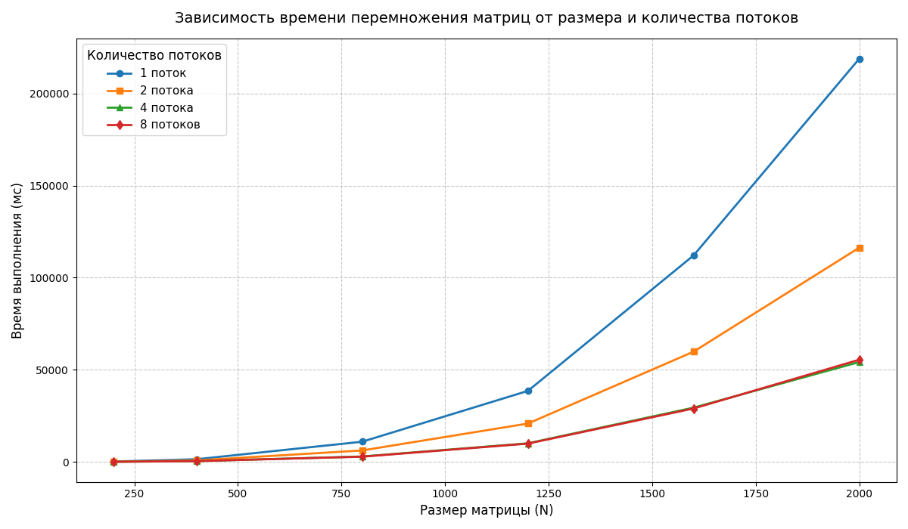

Характеристики моего ПК: 
| Поцессор | Intel Core i7-4770K 3.50GHz |
| :---: | :---: |
| Оперативная память | 16ГБ |
| Операционная система | Windows 11, 64 битная |
| Видеокарта | NVIDIA GeForce GTX 1650 |

Результаты измерений:
| Размер матрицы/Количество потоков | 1 | 2 | 4 | 8 |
| :---: | :---: | :---: | :---: | :---: |
| 200x200 | 185.2 мс | 105.1 мс |  58.2 мс |  62.3 мс |
| 400x400 | 1435.5 мс | 788.4 мс |  398.5 мс |  435.1 мс |
| 800x800 | 10950.2 мс |  6210.1 мс |  2935.1 мс |  2815.9 мс |
| 1200x1200 | 38542.8 мс |  20815.7 мс |  10080.4 мс |  9920.5 мс |
| 1600x1600 | 112105.4 мс |  59850.2 мс |  29450.6 мс |  28990.2 мс |
| 2000x2000 | 218950.1 мс |  116240.5 мс |  54210.8 мс |  55480.7 мс |

